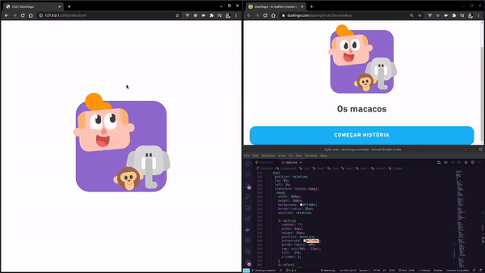
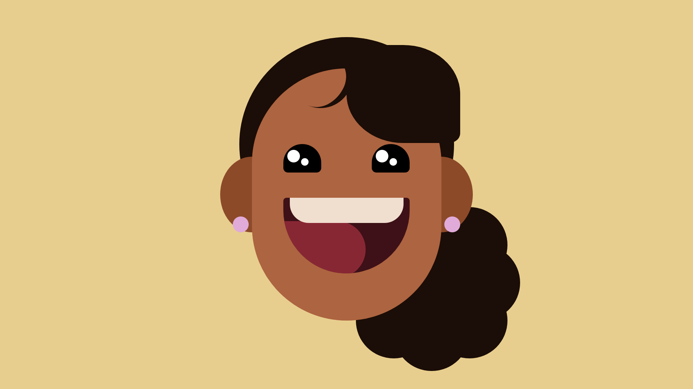
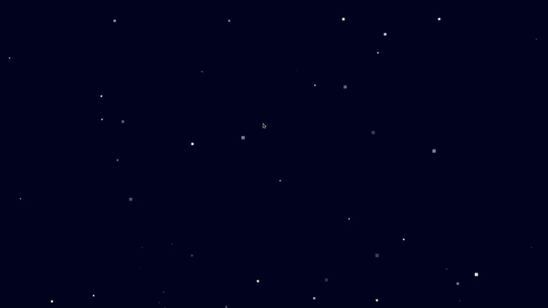
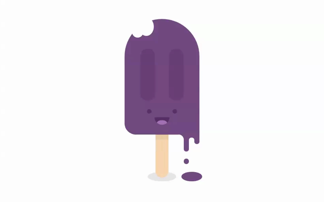
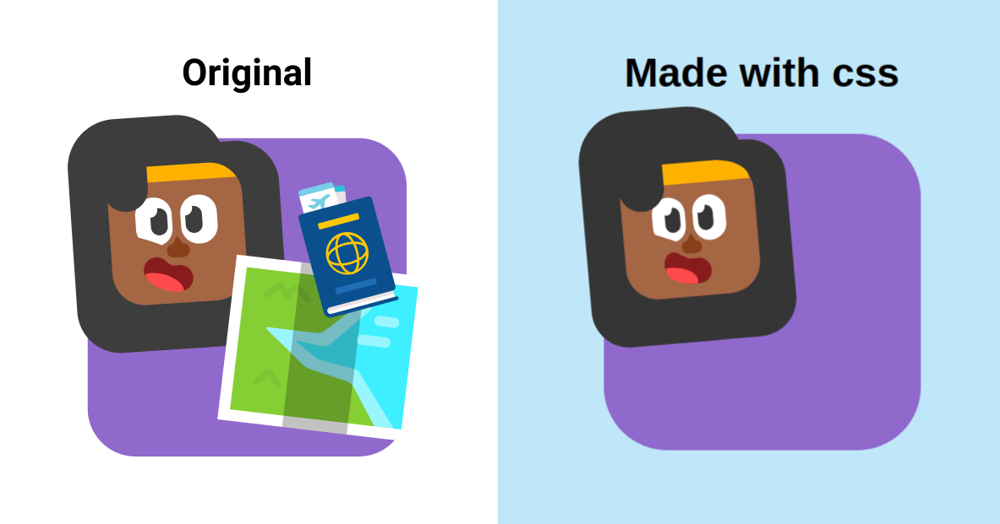

# Artes feitas com CSS e SASS

Neste repositório estão os desenhos que fiz para melhorar minhas habilidades em CSS e SASS/SCSS.
Sempre que a arte original não for minha, colocarei a fonte para dar os devidos créditos ao responsável.

---
## Os desenhos que mais gostei de replicar

### [Menino, elefante e macaco](https://github.com/natalia-fs/aprendendo-css/tree/master/duolingo-animals):

    

### [Me desenhando em estilo Flat Art com CSS](https://github.com/natalia-fs/aprendendo-css/tree/master/Rostos/drawing-myself):

    

### [Among Us - Pixel art](https://github.com/natalia-fs/aprendendo-css/tree/master/among-us-pixel-art):

    

### [Picolé animado](https://github.com/natalia-fs/aprendendo-css/tree/master/Icecream-animation):

    

### [Personagem do app Duolingo](https://github.com/natalia-fs/aprendendo-css/tree/master/duolingo-draw):

    

