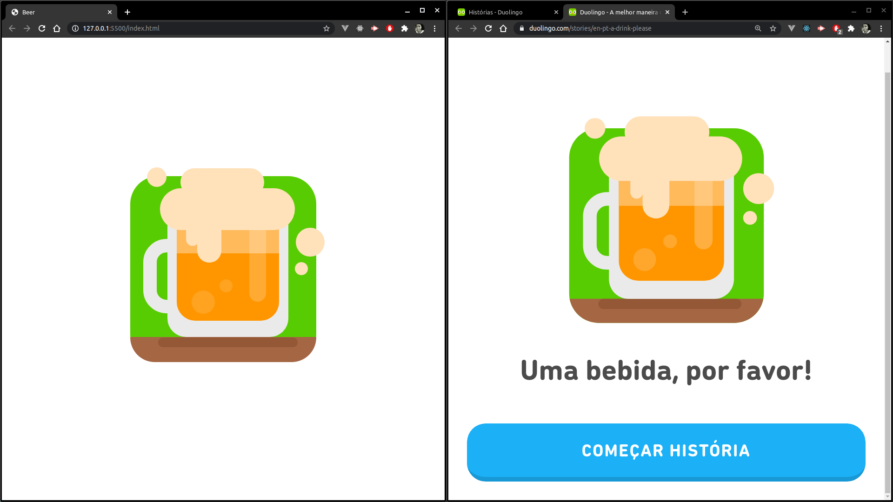

# Desenhando cerveja do aplicativo Duolingo com CSS
## Linguagens e tecnologias
 Praticando desenho com **CSS** usando os pseudo-elementos `::before` e `::after` e aproveitando para melhorar os conhecimentos em **Scss**

## Preview

    

