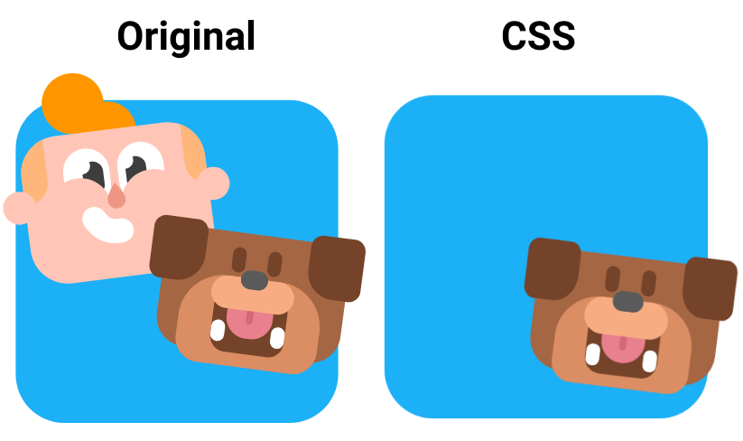

# Desenhando cachorro do aplicativo Duolingo com CSS

## Linguagens e tecnologias
 Praticando desenho com **CSS** usando os pseudo-elementos `::before` e `::after` e aproveitando para melhorar os conhecimentos em **Sass**

 Dessa vez usei bastante a função `calc` do CSS, foi útil para centralizar alguns elementos no desenho.

## Preview

    

