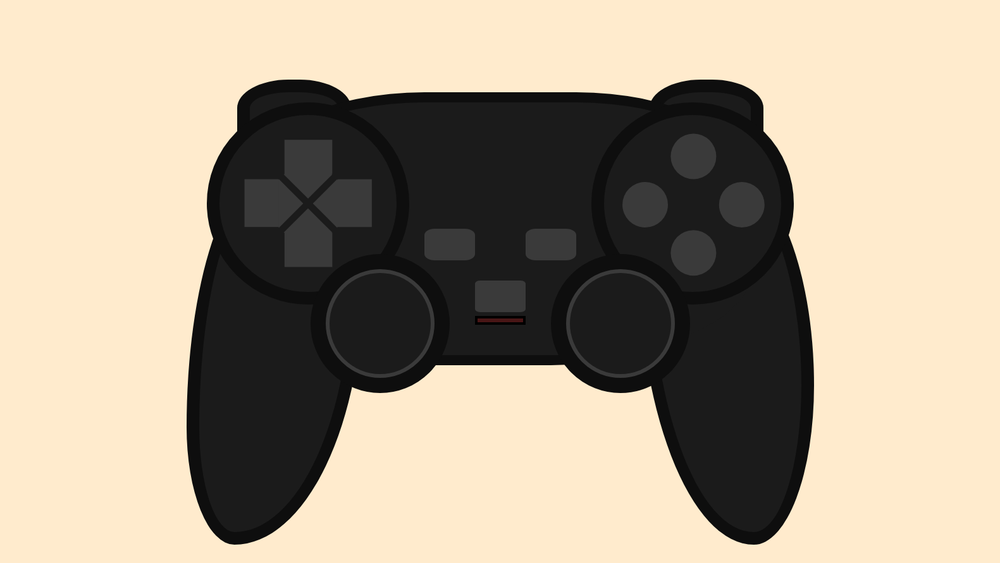

# Controle de videogame

Criando um controle de videogame baseado no controle do PS2 com Scss.

## Speed code
[Desenhando joystick com SCSS - (Speed Code)](https://youtu.be/lMc7pkQqUcA)

## Preview

    

